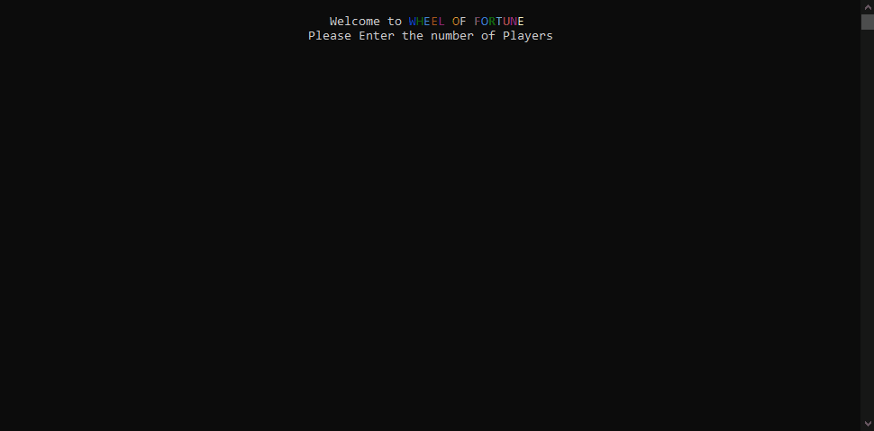

# [Wheel of Fortune](https://v-spacecoders@dev.azure.com/v-spacecoders/WheelOfFortune/_git/WheelOfFortune)

#### A C# Team Project for [Microsoft Leap](https://www.linkedin.com/company/microsoftleap/), 03.08.2021 - 03.19.2021

#### By **SpaceCoders** : Adela Darmansyah, Gulzat Karimova, Hamida Shaik, Luna Campos, Rustam Samigullin

[About](#About) | [MVP Goals](#MVP-Goals) | [UML Class Diagrams](#UML-Class-Diagrams) | [Future Product Roadmap](#Future-Product-Roadmap) | [Installation Instructions](#Installation-Instructions) | [Screenshots](#Screenshots) | [Technologies Used](#Technologies-Used) | [Known Bugs](#Known-Bugs) | [Resources](#Resources) | [Contact and Support](#Contact-and-Support)

## About

A console application that implements the game [Wheel of Fortune](https://en.wikipedia.org/wiki/Wheel_of_Fortune_(American_game_show)). This project aims to familiarize ourselves to commonly used tools at Microsoft, such as Azure Dev Ops, Boards, Repos, and many more.

## MVP Goals
    
1. Supports one player 

2. Choose a string
	
	* Hardcoded is fine 
	* Display dashes for missing letters

3. Allow current player to guess letters 
    
	* If letter is in the word, replace underscores with matching letters 
	* If letter is not in word, let play know and keep playing.

4. Allow current player to solve 
    
	* If guess is correct (not case sensitive), player wins 
	* If guess is not correct, keep playing 

## UML Class Diagrams

#### First Draft of Conceptual Object Model

#### First Draft of Classes Diagram

##  Future Product Roadmap

- [x] Game can have more than 1 player by letting the user input the number of players.   

- [x] Game generates a random word from a list of words instead of hardcoding the word   

- [x] Improve our UI: add colors to the text in console 

- [x] User have the ability to guess the entire word 

- [x] Add a new class of Wheel: after a correct guess, spin the wheel for random prizes/money (use a random generator) 

- [x] At the start of the game, ask player for their name

- [ ] Add competitive mode which would allow player to lose

- [ ] Add exception handling where necessary

- [ ] For choosing a string, have a random sentence generator instead of a random word generator

- [ ] Losing condition: 3 Incorrect Guesses

- [ ] Handling special characters as input

- [ ] Validate input – any characters that is not a letter, display a message “Invalid input – please enter a letter”

- [ ] Press “Esc” to exit the game

- [ ] Handle repeated input by player, example, player presses “P” twice

- [ ] Player Choose a theme and Integrate a phrase generator API for selected theme

- [ ] As a developer, I want to create a player with stats (number of correct & incorrect guesses) so that I can keep track of the player’s number of guesses.

- [ ] As a developer, I want the application to end the game after the whole sentence guessed, so that the player will be able to start game again.

- [ ] Player has the option to restart the game.

- [ ] Add status attribute for game

- [ ] Add a controller class to display word or generate word, update word, etc.

## Installation Instructions

### For local development:

- In Visual Studio, open the solution file, i.e. WheelOfFortune.sln

- To play the game, press Ctrl + F5

- To run all tests, press Ctrl + R, A

## Screenshots

#### Product Demo

## Technologies Used
  
1. C#

2. .NET Framework

3. Visual Studio

4. Azure DevOps

5. MSTest

## Known Bugs

No known bugs at this time.

## Resources

- [Group lab - Wheel of Fortune (SWE TPM)](https://microsoft.sharepoint.com/:w:/t/LEAPCommunity/ERM2C46_RfRMgKWtEpyEwcoBjoNZ8yBjN2y16erGlH0ClA?e=o7hWpU)

- [Group lab Additional Functionalities (Wk 3)](https://microsoft.sharepoint.com/:w:/t/Room8/Eefl3KX43e1JiCG62KnG0nIBOp29BU08TED75I9tC58Ikg)

- [Team's Discussion Document on Sharepoint (Wk 2)](https://microsoft.sharepoint.com/:w:/t/Room8/EecExFrafyxCtZDjZ9TfTpkBkZGocoWyCK1DECzJa7V-FQ?e=eMSePb)

- [Team's UML Diagram on draw.io](https://app.diagrams.net/?src=about#G1RiKxpxDFjbbPTl-lgNWQhrJiozhCm8uF)

- [How-to: Collaborate using Visual Studio](https://docs.microsoft.com/en-us/visualstudio/liveshare/use/vs)

- MSTest: [Anatomy of a Unit Test](https://docs.microsoft.com/en-us/previous-versions/ms182517(v=vs.110))

- MSTest: [Writing Unit Tests for the .NET Framework with the Microsoft Unit Test Framework for Managed Code](https://docs.microsoft.com/en-us/previous-versions/visualstudio/visual-studio-2012/hh598960(v=vs.110))

- MSTest: [Naming Convention & Best Practices](https://docs.microsoft.com/en-us/dotnet/core/testing/unit-testing-best-practices)

- Console Colors: https://www.michalbialecki.com/2018/05/25/how-to-make-you-console-app-look-cool/

- [Azure Pipelines: How to initiate an Azure Pipeline](https://elanderson.net/2020/03/pipeline-creation-in-azure-devops/)

- [Azure Pipelines: Key Concepts](https://docs.microsoft.com/en-us/azure/devops/pipelines/get-started/key-pipelines-concepts?view=azure-devops)

- [Publish a .NET Console Application using Visual Studio](https://docs.microsoft.com/en-us/dotnet/core/tutorials/publishing-with-visual-studio)

- [Azure DevOps: Using Queries](https://docs.microsoft.com/en-us/azure/devops/boards/queries/using-queries?view=azure-devops&tabs=browser)

## Contact and Support

Need help or have any questions, contact SpaceCoders Team:

* Adela Darmansyah 
* Gulzat Karimova 
* Hamida Shaik
* Luna Campos
* Rustam Samigullin